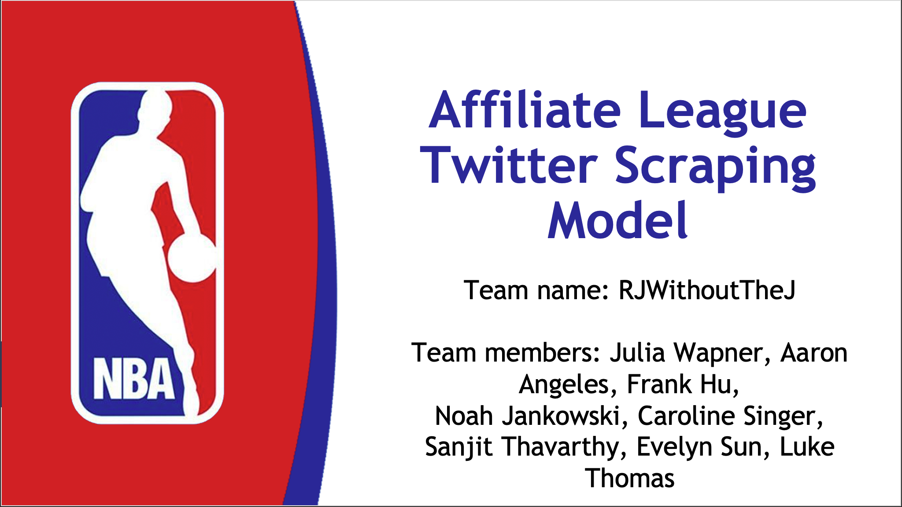

# Social Media Analysis - Affiliate League Twitter Scraping 
## NBA Future Analytics Stars Program
This capstone project was a part of the NBA Future Analytics Stars Program. Under the direction of the NBA League Office, I worked on a Social Media Analysis project that included scraping data from the Twitter API, exploratory analysis and data processing and more refined analysis and model building.

### Overview
The purpose of the investigation was to analyze the most optimal time to tweet, and explore tweet content that leads to high engagement. With four other partners, we analyzed the NBA league account and the team accounts from the affiliate leagues. The affiliate leagues include the NBA 2K League, NBA G-League, and the WNBA. This project took place from August 2021 to December 2021 under the supervision of the NBA League Office and professional mentors. 

### Twitter Scraping & Data Processing
The first component of this investigation was collecting the data. After getting developer access to the Twitter API, my teammates and I pulled tweets from NBA affiliate twitter accounts from January 2021 - November 2021. The majority of the twitter scraping component was done using Python and libraries such as snscrape and tweepy. Further processing of the data was done using the pandas library. The initial processing and data transformation is important for getting the data into a digestable form in order to perform future analyses.

### Exploratory Analysis 
Exploratory analysis was performed in Python and R. My teammates and I wanted to get a good sesne of the data. We created visualizations in Python and R and ran initial models to identify existing trends. 
The majority of exploratory procedures sought to investigate tweet volume by various dimensions (time, media type etc)

### Model Building
After the exploratory portion, we narrowed the focus point of the project to be centered around investigating the best times to tweet and the content type that leads to the best possible engagement. My teammates and I looked at initial OLS regressions, decision trees but we decided to pivot the analysis to a negative binomial model and polynomial regression model. The main motivation was for interpretable results but further justification for these decisions is mentioned within the final slide deck.

### Results
For each league affiliate, we outlined some key takeaways. Those included, but were not limited to, optimal times to tweet and ideal media types. Other reccomendations were included in the final slide deck. 

### Slide Deck

